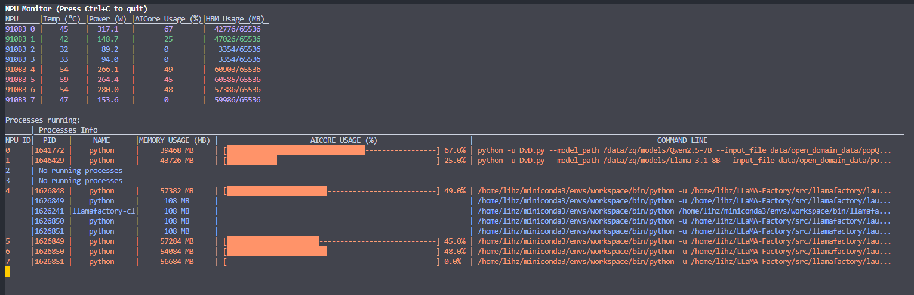

# NPU Monitoring Tool

A simple and easy-to-use NPU (HUAWEI ASCEND) monitoring tool based on curses, designed for real-time monitoring of Huawei Ascend NPU usage.

## Features

*   **Real-time Monitoring:** Real-time display of various NPU metrics, including power consumption, temperature, AI Core utilization, memory usage, etc.
*   **Concise Interface:** Uses the curses library to create a text-based interface, which is simple and intuitive.
*   **Configurable Refresh Rate:** Users can customize the refresh rate of the monitoring data.
*   **Log Recording:** Records program running logs for easy troubleshooting.
*   **Color Display:** Uses different colors based on temperature and memory usage to more intuitively reflect the NPU status.

## Screenshot


## Installation

1.  **Clone the repository:**

    ```bash
    git clone https://github.com/HackGiter/npu-monitor
    cd npu-monitor
    ```

2.  **Install Dependencies:**

    This project relies on the `npu-smi` command. Please ensure that the Ascend NPU driver and the `npu-smi` tool are correctly installed in your environment.

3. **(Optional) Create Virtual Environment:**
    It is recommended to run the project in a virtual environment.
    ```bash
    python3 -m venv .venv
    source .venv/bin/activate
    ```
4. **Installation:**

    ```bash
    git install -e .
    ```
    or install from github directly
    ```bash
    pip install git+[https://github.com/HackGiter/npu-monitor.git](https://github.com/HackGiter/npu-monitor.git)
    ```

## Usage

1.  **Run the program:**

    ```bash
    python -m npu_monitor.main
    ```

2.  **Command-line arguments:**

    *   `-r` or `--refresh-rate`: Set the refresh rate (in seconds), default is 1.0. For example: `python -m npu_monitor.main -r 0.5`
    *   `-l` or `--log-level`: Set the log level (DEBUG, INFO, WARNING, ERROR, CRITICAL), default is INFO. For example: `python -m npu_monitor.main -l DEBUG`

## Project Structure
```markdown
npu-monitor/
├── logger/            # Custom logging module (if used)
│   └── logging.py
├── npu_monitor/
│   ├── __init__.py
│   ├── hparam.py      # Color and constant definitions
│   ├── main.py        # Main program entry point
│   ├── npu_monitor.py # Monitoring logic
│   └── utils.py       # Helper functions
├── README.md          # This file
└── ...
```